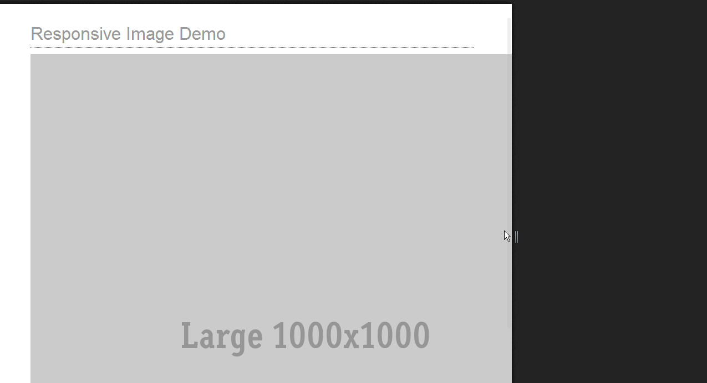

This is no longer maintained :(  
===============================  

concrete5-responsive-images
===========================

Concrete5 Responsive Image Block Using Foundation Interchange and Picturefill  
- http://foundation.zurb.com/docs/components/interchange.html
- https://github.com/scottjehl/picturefill  
 
a concrete5 add-on that uses Responsive Image techniques.  

Foundation Interchange
======================  
**stock/standard Foundation media queries**
  

**custom media queries with extra large image for bigger displays/retina displays** 
  

PictureFill 
===========
  
  
**Custom Media Queries with an image specifically for landscape**

**To Do**  
[ ] lots... maybe polymer x-picture
